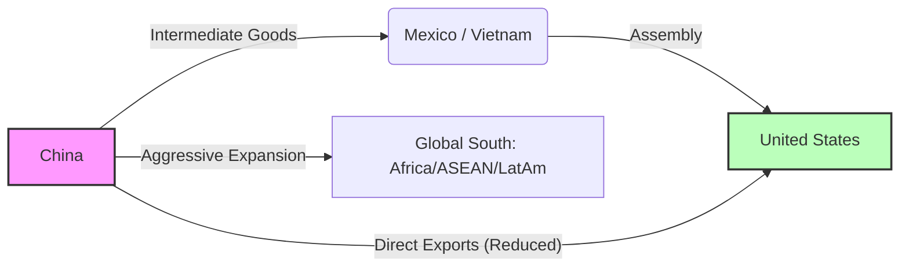

# China’s Surging Trade Surplus Amid Global Trade Tensions (2010–2025)

**Date:** January 2026
**Topic:** Global Trade & Economic Analysis

---

## Executive Summary

Despite intensifying U.S.-China trade tensions since 2018 and efforts to diversify supply chains, China’s trade surplus has expanded to record levels.
*   **2022:** Goods trade surplus neared **$890 billion** (all-time high).
*   **2025:** Surplus broke the **$1 trillion** mark ($1.189 trillion).

This growth is driven by:
1.  **Dominant Manufacturing:** Electronics, machinery, and increasingly automobiles/green tech ("New Three").
2.  **Macroeconomic Factors:** Competitive currency, weak domestic demand suppressing imports, and state-led industrial policies.
3.  **Market Diversification:** Expansion into Asia, Africa, and Latin America to offset U.S. declines.

---

## 1. Historical Trends: 2010–2017 vs. Post-2018 Surge

### Phase I: Rebalancing (2010–2017)
In the early 2010s, China’s trade surplus as a share of GDP shrank.
*   **2007 Peak:** >10% of GDP.
*   **2018 Low:** ~0.2% of GDP (Current Account).
*   **Drivers:** RMB appreciation, rising wages, and policies boosting domestic demand.

### Phase II: The Trade War Expansion (2018–Present)
Ironically, the surplus entered a new expansionary phase precisely when the U.S. began its trade war.
*   **2017 Surplus:** ~$780 billion.
*   **2022 Surplus:** ~$1.13 trillion (doubled in 5 years).
*   **Net Change (2017-2022):** Exports +$1.1T vs. Imports +$640B.

### Why the Post-2018 Surge?
*   **Global Trade Diversion ("Indirect Exports"):** Reduced direct exports to the U.S. were offset by intermediate goods shipped to Mexico/Vietnam for assembly and re-export to the U.S.
*   **Pandemic Export Boom (2020–2021):** Global demand for PPE and work-from-home electronics met China's swift industrial recovery.

---

## 2. Sectoral Drivers of the Surplus

China’s trade surplus is overwhelmingly driven by its manufacturing exports (estimated **35%** of global manufacturing output).

### A. Manufacturing Dominance
| Sector | Contribution | Trend |
| :--- | :--- | :--- |
| **Mechanical & Electrical** | **~60%** of total exports (2025) | Includes smartphones, computers, industrial equipment. |
| **Capital Goods** | High Growth | Supplying "tools of production" (machine tools) to industrializing ASEAN/Africa. |
| **Automobiles** | **World #1 Exporter** (2023) | Overtook Japan. 5.26m units exported in 2023 (+62%). |
| **Traditional Goods** | Shrinking Share | Textiles/Furniture still run surpluses but are "venting" excess capacity due to weak domestic demand. |

### B. The "New Three" (Green Tech)
China exports an entire "New Energy Ecosystem":
*   **Products:** Solar panels, Lithium-ion batteries, Electric Vehicles (EVs).
*   **Performance:** Exports exceeded **¥1 trillion ($150B)** in 2023 (+29.9%).
*   **Strategic Impact:** Reducing global reliance on the dollar-based fossil fuel system.

### C. Energy & Commodities (The Deficit)
*   **Net Importer:** Oil, gas, iron ore, copper.
*   **Dynamics:** 2021-2022 saw price spikes, but export value growth outpaced import costs.
*   **Value Add:** China "imports cheap (commodities) and exports dear (manufactures)."

---

## 3. Macroeconomic Factors

### Exchange Rate Competitiveness
*   **Policy:** Managed float. Allowed RMB to weaken during trade war/tariff hikes to offset costs.
*   **2025:** Monthly surpluses >$100B, aided by a weakened yuan.

### Weak Domestic Demand (The Core Imbalance)
*   **Consumption:** Only ~38–40% of GDP.
*   **Property Crisis:** Since 2021, the real estate slump has crushed consumer confidence and imports.
*   **"Involution":** Cutthroat domestic competition forces firms to export excess capacity to survive.

### Supply Chain Restructuring
*   **"China+1":** Manufacturing shifts to Vietnam/India often result in China supplying the components, reinforcing its role as the upstream hub.
*   **RCEP:** The regional trade pact has integrated ASEAN supply chains with China at the center.

---

## 4. Resilience vs. Decoupling

### Tariff Impact
*   **Result:** Tariffs caused **trade diversion**, not destruction.
*   **U.S. Deficit:** Hit record highs in 2022 despite tariffs, due to U.S. macro factors (stimulus/savings).

### Counter-Strategies
1.  **Market Pivot:** ASEAN overtook EU/U.S. as China's #1 trading partner.
2.  **Tech Self-Reliance:** "Made in China 2025" reduced reliance on foreign high-tech inputs.
3.  **Non-Tariff Barriers:** Informal reduction of U.S. imports (e.g., switching soy purchases to Brazil).

---

## 5. Recent Trade Data Highlights (2018–2025)

| Year | Exports (FOB) | Imports (CIF) | Trade Surplus | Context |
| :--- | :--- | :--- | :--- | :--- |
| **2018** | ~$2,487B | ~$2,135B | **~$352B** | Trade war begins. |
| **2019** | ~$2,498B | ~$2,078B | **~$420B** | Stabilization. |
| **2020** | ~$2,590B | ~$2,057B | **~$533B** | Pandemic onset. |
| **2021** | ~$3,364B | ~$2,694B | **~$670B** | Post-pandemic surge. |
| **2022** | **$3,593B** | $2,715B | **$878B** | Record high (at time). |
| **2023** | ~$3,500B | ~$2,700B | **~$800B** | Slight dip (global slowdown). |
| **2024** | (Est.) | (Est.) | **High** | Continued elevation. |
| **2025** | High Growth | Moderate | **$1.189T** | **All-time Record.** |

*Sources: Chinese Customs (GAC), Wind/CEIC, Analysis.*

---

## Conclusion: Outlook & Implications

**For China:**
The surplus provides leverage and foreign reserves but exposes the economy to protectionist backlash (e.g., EU anti-subsidy probes). It highlights a critical vulnerability: **dependence on external demand** due to insufficient domestic consumption.

**For the World:**
China's role has evolved from a provider of cheap labor to a provider of advanced "New Energy" infrastructure. Decoupling has proven to be a "bypass" rather than a break. Barring major structural reforms to boost Chinese household consumption, the massive trade surplus is likely to endure, defining the next era of global geoeconomics.

### Sources
*   General Administration of Customs of China (GAC)
*   IMF World Economic Outlook
*   European Central Bank (ECB) Economic Bulletin
*   Peterson Institute for International Economics (PIIE)