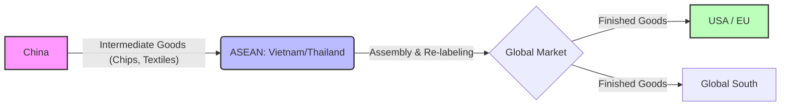
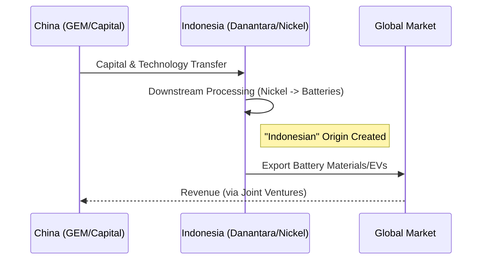

# The Great Divergence: Anatomy of China’s Structural Trade Surplus (2025-2026)

**Date:** January 2026  
**Topic:** Geoeconomic Fragmentation & Global Trade  

---

## Executive Assessment: The $1.2 Trillion Paradox

In the annals of modern economic history, the year 2025 will likely be recorded as a point of rupture—a moment when the gravitational laws of global trade appeared to invert. Against a backdrop of intensifying geopolitical hostility, a resurgent trade war led by the "Trump 2.0" administration in the United States, and a synchronized erection of tariff barriers across the European Union and the Global South, the **People's Republic of China** did not retreat. Instead, it posted a trade surplus of approximately **$1.189 trillion**, the largest external imbalance ever recorded by a single nation-state.

> **Context:** This surplus is roughly equivalent to the entire GDP of Saudi Arabia. It represents ~10% of China's own GDP, a ratio far exceeding historical peaks of Japan or Germany.

The central inquiry of this report is to dismantle the mechanics of this surplus. It argues that the 2025 surplus is not a sign of economic health, but a symptom of **"involution"**—fierce internal competition driving producer prices into deflation, forcing firms to export excess capacity. This has occurred alongside a pivot in global supply chains, where the Global South has replaced the West as the primary engine of China’s external demand.

---

## Section I: The Macroeconomic Engine of Disequilibrium

To understand why Chinese ships are leaving ports fully laden while returning relatively light, one must look inward at the structural distortions of the Chinese economy.

### 1.1 The Scars of the Property Crisis
The collapse of the real estate market (beginning in 2021) triggered a "negative wealth effect," leading households to aggressively save.
*   **Exports (Dec 2025):** +6.6%
*   **Imports (Full Year):** 0.0%

This creates a **"recessionary surplus"**—a trade balance that expands because China is buying significantly less, not just because the world is buying more.

### Table 1: The Divergence of Trade Flows (2025 Performance)

| Trade Metric | Performance (YoY) | Economic Driver |
| :--- | :--- | :--- |
| **Total Exports** | **+5.5%** (Full Year) | Supply-side stimulus, deflationary pricing, market diversification |
| **Total Imports** | **0.0%** (Full Year) | Weak domestic demand, property crisis, import substitution |
| **Export Value (Dec)** | **+6.6%** | Front-loading before new tariffs, resilience of "New Three" |
| **Import Value (Dec)** | **+5.7%** | Minor recovery due to strategic stockpiling (commodities) |

*Data Source: Customs General Administration of China, ING Think Analysis.*

### 1.2 "Involution" and the Deflationary Export Subsidy
Industrial **"involution"** (neijuan) has led to 38 consecutive months of negative producer price inflation (PPI). This deflation acts as a de facto export subsidy, absorbing the blow of foreign tariffs.

### 1.3 The Profitability Crisis
Nearly **34%** of firms in high-growth sectors (EVs, solar) operated at a loss in 2025. This "zombie lending" allows firms to export at marginal cost, flooding global markets.

---

## Section II: The "New Three" – Technocratic Industrial Policy

The **"New Three"** (EVs, Batteries, Solar) have superseded the "Old Three" (Clothing, Furniture, Appliances).

### 2.1 Electric Vehicles: The Global Blitzkrieg
*   **Exports:** >7 million units (+21% YoY).
*   **Strategy:** Pivoting to Europe (12.8% market share) and surging Plug-in Hybrid (PHEV) exports to address range anxiety.

### 2.2 Solar Photovoltaics: The Limits of Volume
*   **Volume:** Record highs (46 GW in Aug).
*   **Value:** Collapsed due to price drops ($0.07-0.09/watt).
*   **Policy Shift:** In late 2025, China canceled the 13% VAT export rebate to force consolidation and raise prices (+9% projected in Q4).

### 2.3 Batteries: The Indispensable Link
China controls **69%** of the global EV battery market. Even as the West builds "battery belts," they remain dependent on Chinese refined lithium and cathode materials.

### Table 2: The "New Three" Export Performance (2024-2025)

| Sector | Export Volume Growth | Price Trend | Strategic Response |
| :--- | :--- | :--- | :--- |
| **Electric Vehicles** | **+21%** | Stable/Rising (Mix Shift) | Localization in EU/ASEAN (BYD Hungary/Thailand) |
| **Solar Modules** | **+16%** | **-40%** (Value) | Cancellation of Export Rebates (Consolidation) |
| **Lithium Batteries** | **+23%** | Declining | Dominance of Global Supply Chain (CATL) |

*Data Source: Ember Energy, Wood Mackenzie, AP News.*

---

## Section III: The Unsung Heavyweights

### 3.1 The Battle for Earth: SANY vs. Caterpillar
With domestic construction dead, SANY Heavy Industry pivoted abroad.
*   **SANY Global Revenue:** 60.3% of total.
*   **Market Share:** 17% of global excavators (challenging Caterpillar).

### Table 3: Global Construction Machinery Market Share (2025)

| Manufacturer | Origin | Global Market Share | Key Growth Markets (2025) |
| :--- | :--- | :--- | :--- |
| **Caterpillar** | USA | ~16.3% | North America (Reshoring) |
| **SANY Heavy** | China | ~17.0% | Africa (+40%), Indonesia (+10%) |
| **Komatsu** | Japan | ~10.7% | Mining Sector |
| **XCMG** | China | ~5.8% | Belt & Road Infrastructure Projects |

*Data Source: KHL Yellow Table, Pestel Analysis.*

### 3.2 The Petrochemical Transformation
China has shifted from the world's largest importer to a net exporter of petrochemicals, creating a glut in ethylene (11.5m tonne surplus) and propylene (20.3m tonne surplus).

---

## Section IV: Technological Autarky

### 4.1 Semiconductor Breakthroughs
*   **Legacy:** SMEE deploying 28nm lithography machines.
*   **Future:** Prototyping EUV capabilities (aiming for 2028-2030).

### 4.2 Medical Devices
"Local content" mandates have propelled firms like **Mindray** to replace GE/Siemens in domestic hospitals and capture market share in Latin America/ASEAN with 30-40% price discounts.

---

## Section V: The Geographic Pivot – Transshipment

Exports to the U.S. fell ~20%, yet total exports rose. The solution? The **"Connector Economy"**.

### 5.1 ASEAN: The Connector
China exports intermediate goods to Vietnam/Thailand, which are assembled and re-exported to the West.

### 5.2 Latin America: The Strategic Backyard
*   **Port of Chancay (Peru):** A new direct artery to Shanghai, bypassing U.S. routes.
*   **The Soy Swap:** Shifting purchases to Brazil to sideline U.S. farmers.

---

## Section VI: Capital Exports – The Indonesia Case Study

China is moving from exporting goods to exporting *capacity*.

### 6.1 The Danantara-GEM Nexus
In 2025, Indonesia's sovereign wealth fund (Danantara) partnered with China's GEM to control the nickel supply chain.

By processing nickel in Indonesia, Chinese firms "launder" the national origin, bypassing direct tariffs on Chinese goods.

---

## Section VII: The Global Backlash

### 7.1 The U.S. Tariff Wall
*   **Universal Tariffs:** 10-60%.
*   **Loophole Closed:** *De minimis* suspended for Shein/Temu.
*   **Avg Tariff:** 57.6%.

### 7.2 The Global South Revolts
Brazil, Indonesia, and Turkey have all imposed protectionist measures against Chinese dumping, signaling that the "China Price" is becoming a political liability even among allies.

---

## Section VIII: Future Outlook

### 8.1 Currency Dynamics
The $1.2T surplus puts immense pressure on the RMB. While currently managed, analysts forecast appreciation toward **6.85-6.90** in 2026.

### 8.2 The Road to 2030
The "export-to-grow" model is hitting a wall. Without domestic rebalancing (boosting household consumption), the 15th Five-Year Plan faces an existential crisis.

> **Conclusion:** The surplus of 2025 is likely the high-water mark of globalization before the tide of fragmentation fully recedes.

---

## References & Further Reading

*   **Trade Data:** [China's trade surplus surges 20% to record $1.2 trillion (AP News)](https://apnews.com)
*   **Economic Analysis:** [China's huge trade surplus – where next? (Deutsche Bank)](https://flow.db.com)
*   **Energy Sector:** [China's clean technology exports hit record high (Ember)](https://ember-energy.org)
*   **Solar Costs:** [Solar and storage costs set to increase 9% (Wood Mackenzie)](https://woodmac.com)
*   **Heavy Industry:** [Sany Heavy Industry turns to Asia and Africa (Construction Briefing)](https://constructionbriefing.com)
*   **Medical Tech:** [US Tariff Announcements on Medical Devices (Vamstar)](https://vamstar.io)
*   **Geopolitics:** [China accelerates investment in Brazil (El Pais)](https://english.elpais.com)